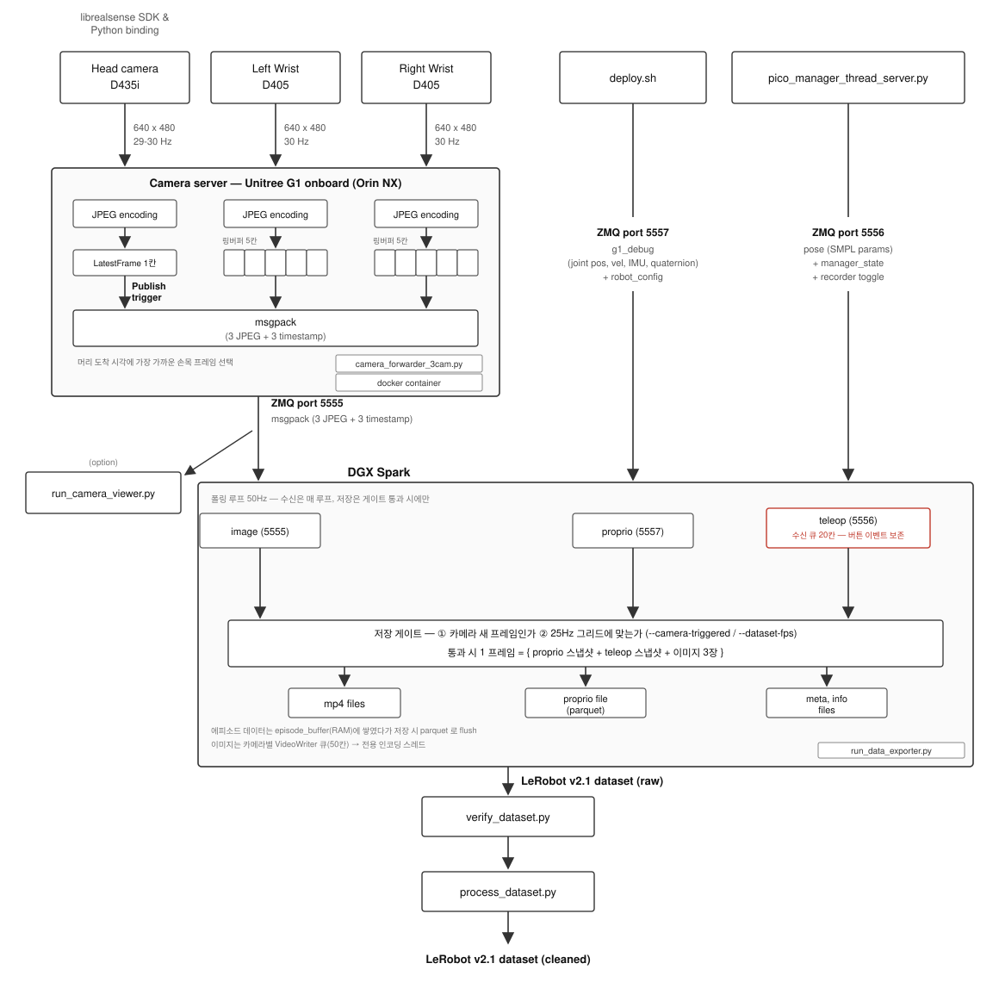
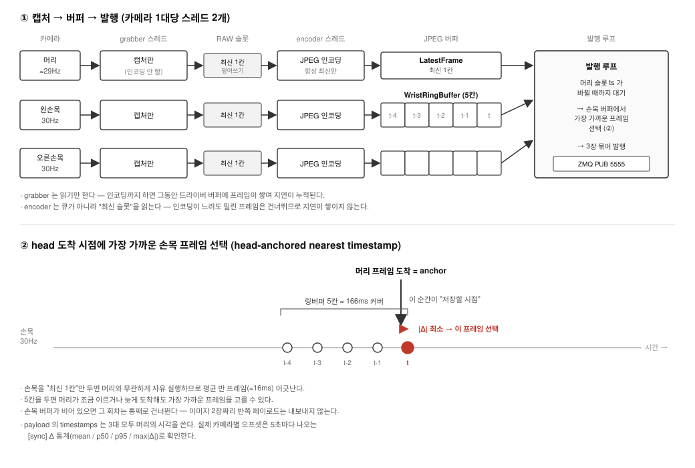

# 데이터 수집 파이프라인 인수인계 문서

**DGX Spark(워크스테이션) ↔ Unitree G1 Orin NX(온보드)** 통신을 통해 VLA 파인튜닝용
LeRobot v2.1 데이터셋을 수집하는 파이프라인의 운영 문서.



| 항목 | 값 |
|---|---|
| 워크스테이션 | DGX Spark (offboard) |
| 로봇 | Unitree G1 + Orin NX (onboard), `192.168.123.164` (`unitree` / `123`) |
| 카메라 | 머리 1대 + 손목 D405 2대 (3-cam 구성) |
| 산출물 | LeRobot v2.1 dataset (`outputs/<YYYY-MM-DD-HH-MM-SS>/`) |
| 리포 경로 (Orin) | `~/tw_gearsonic/GR00T-WholeBodyControl` |
| 리포 경로 (DGX) | `~/GR00T-WholeBodyControl` |


---

## 주로 봐야 하는 파일

| 실행 위치 | 파일 | 역할 |
|---|---|---|
| **Orin** | [docker/src/camera_forwarder_3cam.py](docker/src/camera_forwarder_3cam.py) | 카메라 서버 본체. 3대 스레드 → 머리 프레임 도착 시 병합 → ZMQ 5555 발행. **bind-mount라 수정해도 이미지 재빌드 불필요** |
| **Orin** | [docker/run_ltw_camera_server_ros2foxy_v8.sh](docker/run_ltw_camera_server_ros2foxy_v8.sh) | 위 스크립트를 컨테이너로 띄우는 런처. 환경변수(`HEAD_SERIAL` 등) 해석. **주석에 설계 근거가 가장 많이 적혀 있음** |
| **DGX** | [gear_sonic/scripts/run_data_exporter.py](gear_sonic/scripts/run_data_exporter.py) | 데이터 수집 본체. 5555+5556+5557 구독 → 프레임 조립 → LeRobot 데이터셋 기록 |
| **DGX** | [gear_sonic/scripts/pico_manager_thread_server.py](gear_sonic/scripts/pico_manager_thread_server.py) | PICO teleop 서버. VR 버튼 → 모드 전환 / 에피소드 녹화 토글, pose를 5556으로 발행 |

### 보조 스크립트

| 실행 위치 | 파일 | 역할 |
|---|---|---|
| Orin | [docker/list_realsense_serials.sh](docker/list_realsense_serials.sh) | **실행 전 필수** — librealsense 시리얼 열거 (§3) |
| Orin | [docker/disable_d405_autosuspend.sh](docker/disable_d405_autosuspend.sh) | **실행 전 필수** — D405 USB autosuspend 해제 (§4) |
| DGX | [gear_sonic/scripts/verify_dataset.py](gear_sonic/scripts/verify_dataset.py) | 수집 후 데이터셋 검증 (§7) |
| DGX | [gear_sonic/scripts/run_camera_viewer.py](gear_sonic/scripts/run_camera_viewer.py) | 카메라 피드 실시간 확인(디버깅) |
| DGX | [gear_sonic_deploy/deploy.sh](gear_sonic_deploy/deploy.sh) | C++ deploy 실행 → 5557로 로봇 상태 발행 |

### 참고 문서 / 환경 구축

| 파일 | 역할 |
|---|---|
| [docker/README.3cam_pipeline.md](docker/README.3cam_pipeline.md) | 3-cam 파이프라인 설계 배경 — 코드가 왜 이렇게 생겼는지 (병목 해결 내역, 머리 취득 경로 변천) |
| [docker/Dockerfile.ltw_camera_server_ros2foxy_v8](docker/Dockerfile.ltw_camera_server_ros2foxy_v8) | 카메라 서버 이미지 정의 (librealsense RSUSB 소스빌드, 재빌드 시 ~40분) |
| [install_scripts/install_data_collection.sh](install_scripts/install_data_collection.sh) | DGX `.venv_data_collection` 생성 |
| [install_scripts/install_pico.sh](install_scripts/install_pico.sh) | DGX teleop 환경 설치 |

---

## 1. 포트 맵

| 포트 | 방향 | 발행자 | 토픽/내용 |
|---|---|---|---|
| 5555 | Orin → DGX | `camera_forwarder_3cam.py` (Docker) | msgpack `{timestamps, images}`, JPEG 3장 |
| 5556 | DGX 내부 | `pico_manager_thread_server.py` | `pose`(SMPL body params), `planner`, `manager_state` |
| 5557 | DGX 내부 | C++ deploy (`zmq_output_handler`) | `g1_debug`(로봇 상태), `robot_config`(~2초마다 재발행) |

`robot_config`는 데이터셋 `info.json`의 `script_config`로 들어간다. exporter는 이 메시지를
받을 때까지 시작하지 않는다(`--robot-config-timeout 0` = 무한 대기가 기본).

---

## 2. Step 1 — 사전점검 (Orin, 재부팅 후 매번)

```bash
# --- DGX에서 Orin 접속 ---
ping -c 3 192.168.123.164
ssh unitree@192.168.123.164            # pw: 123

# (네트워크를 바꿔야 할 때만 — 공유 로봇이므로 주의)
# sudo nmcli device wifi connect "delight" password "shy80@kist"

# --- 이하 Orin에서 ---
cd ~/tw_gearsonic/GR00T-WholeBodyControl
git pull
git log --oneline -1

# 1) 파일시스템 이상 (재부팅 중 전원차단 흔적)
sudo dmesg | grep -iE "ext4|EXT4|recovery|corrupt" | head
#    "ordered data mode" / "re-mounted" 만 있으면 정상.
#    corrupt / error 가 보이면 진행하지 말 것.

# 2) ★가장 중요 — docker 이미지 생존 확인 (없으면 재빌드 40분)
sudo docker images | grep ltw-camera-server
#    기대: 1.1-foxy-3cam (v8, 실사용) + 1.0-foxy-3cam (v7, 롤백용)

# 3) repo 정상
git status                             # clean 이어야 함
```

---

## 3. Step 2 — 카메라 시리얼 실측 ★ 매번 필수

```bash
# Orin에서
cd ~/tw_gearsonic/GR00T-WholeBodyControl
sudo ./docker/list_realsense_serials.sh
```

출력 — 명령어에 넣을 값만 나온다:

```
HEAD_SERIAL=046322250434          # Intel RealSense D455
LEFT_WRIST_SERIAL=260322270228    # Intel RealSense D405
RIGHT_WRIST_SERIAL=260422272337   # Intel RealSense D405

# 복사해서 실행 (손목 좌/우가 맞으면 손목 시리얼은 생략 가능)
WRIST_BACKEND=realsense HEAD_SERIAL=046322250434 \
  sudo -E ./docker/run_ltw_camera_server_ros2foxy_v8.sh
```

마지막 두 줄을 그대로 복사해 터미널 1에서 실행하면 된다.

이 스크립트는 컨테이너 안에서 `camera_forwarder_3cam.py --list-serials`를 실행한다
(pyrealsense2가 호스트에는 없고 이미지 안에만 있기 때문). 스트림을 시작하지 않는
단순 열거이므로 서버를 띄우기 전에 안전하게 돌릴 수 있다.

> D405의 by-id color 노드(`--left-node` / `--right-node` 용)까지 봐야 하면
> `sudo ./docker/list_realsense_serials.sh -v` 로 실행한다.


| 종류 | 출처 | 예시 | 용도 |
|---|---|---|---|
| **librealsense 시리얼** | `list_realsense_serials.sh` | `346122071399`, `260322270228`, `260422272337` | ✅ **명령어에 넣는 값** (`HEAD_SERIAL`, `LEFT/RIGHT_WRIST_SERIAL`) |
| sysfs(USB 디스크립터) 시리얼 | `disable_d405_autosuspend.sh` 출력, `/dev/v4l/by-id/...` | `255323071827`, `255323073651` | ❌ 카메라 서버에 넣지 말 것 (`--left-node`/`--right-node` 전용) |

같은 물리 카메라라도 두 값은 **다르다**(계층이 다르다).

> **시리얼을 잘못 넣으면** librealsense가 "No device connected" 재시도 루프를 돌며
> USB 버스를 흔들어, 머리가 아예 안 뜨고 손목까지 ~3Hz로 떨어진다.
> 카메라 하드웨어 고장으로 오진하기 매우 쉬우므로 주의.

측정한 값을 아래에 적어두고 이후 명령에 그대로 사용한다.

| 카메라 | librealsense 시리얼 | 플래그 |
|---|---|---|
| 머리 | `<실측값>` | `HEAD_SERIAL` ← **명령어에 직접 입력** |
| 왼손목 D405 | `<실측값>` | (미지정 시 자동배정 = left) |
| 오른손목 D405 | `<실측값>` | (미지정 시 자동배정 = right) |

### ★ 머리 카메라는 우리가 직접 교체한다 → 매번 실측 → 매번 직접 입력

머리 유닛은 우리 쪽에서 교체하는 부품이다. **교체하면 시리얼이 바뀌고, 바뀐 값을
터미널 1 명령어의 `HEAD_SERIAL=` 에 직접 넣어줘야 한다.** 자동 감지에 의존하지 않는다.

```
[교체]  머리 카메라 교체
   ↓
[실측]  sudo ./docker/list_realsense_serials.sh   → 새 librealsense 시리얼 확인
   ↓
[입력]  WRIST_BACKEND=realsense HEAD_SERIAL=<방금 확인한 값> \
          sudo -E ./docker/run_ltw_camera_server_ros2foxy_v8.sh
```

> `HEAD_SERIAL`을 생략하면 forwarder가 "이름에 405가 없는 장치"를 자동 선택하지만,
> 이 자동 선택에 기대지 말 것. 손목 D405 2대와 섞일 여지가 있으므로 **머리는 항상
> 명시적으로 시리얼을 지정한다.**

---

## 4. Step 3 — 실행 (터미널 5개, 순서 중요)

> ⚠️ **녹화(터미널 4 exporter)는 맨 마지막에, 카메라 서버가 안정화된 것을 확인한 뒤에만 시작한다.**
> 안정화 전에 녹화하면 앞부분이 손목 정지 프레임으로 오염되어 검증에서 FAIL 난다.

### 터미널 1 — 카메라 서버 (Orin NX, SSH)

```bash
cd ~/tw_gearsonic/GR00T-WholeBodyControl

# D405 USB autosuspend 끄기 — 부팅/USB 재연결 때마다 매번 필요
sudo bash ./docker/disable_d405_autosuspend.sh

# 3-cam 서버 기동
# ★ HEAD_SERIAL 에는 Step 2에서 실측한 머리 시리얼을 직접 입력한다.
#   머리 카메라를 교체했다면 반드시 새로 실측한 값으로 바꿔 넣을 것.
WRIST_BACKEND=realsense HEAD_SERIAL=<실측_머리_시리얼> \
  sudo -E ./docker/run_ltw_camera_server_ros2foxy_v8.sh

# 입력 예시 (머리가 D435i 346122071399 였을 때)
# WRIST_BACKEND=realsense HEAD_SERIAL=346122071399 \
#   sudo -E ./docker/run_ltw_camera_server_ros2foxy_v8.sh
```

**손목 좌/우가 뒤바뀌었으면** 시리얼을 명시해 재실행한다:

```bash
LEFT_WRIST_SERIAL=<실측값> RIGHT_WRIST_SERIAL=<실측값> \
WRIST_BACKEND=realsense HEAD_SERIAL=<실측_머리_시리얼> \
  sudo -E ./docker/run_ltw_camera_server_ros2foxy_v8.sh
```

<details>
<summary>autosuspend를 왜 끄는가</summary>

이 Jetson(L4T r35.3.1)에서 D405를 스트리밍하면 USB3 링크 전력관리(U1/U2 LPM) 때문에
수 초 뒤 스트림이 wedge된다 (`uvcvideo: Failed to set UVC probe control: -32`).
`power/control`을 `on`으로 두면 이 전환이 사라진다. 이 값은 재부팅/USB 재연결 시
기본값(`auto`)으로 돌아가므로 **서버를 띄우기 전 매번** 실행해야 한다.
머리 카메라는 영향 없는, D405 특유의 문제다.
</details>

#### 🚦 안정화 게이트 — 여기서 반드시 대기

서버 시작 직후 손목이 startup wedge로 잠깐 멈출 수 있다
(`left_wrist wait_for_frames 실패` / `★ WEDGE`). RSUSB가 스스로 재시작해 복구하므로,
아래 줄이 **연속 3~5회 깨끗하게** 뜰 때까지 기다린다:

```
[3cam] content(new frames): ego_view=29.x  left_wrist=30.0Hz  right_wrist=30.0Hz
```

⛔ `left_wrist=0.0Hz` / `★ WEDGE` / `프레임 오래됨`이 보이면 아직이다. **녹화 시작 금지.**

### 터미널 5 — 카메라 뷰어 (DGX) ※ 녹화 전 눈으로 확인

```bash
cd ~/GR00T-WholeBodyControl
source .venv_data_collection/bin/activate
python gear_sonic/scripts/run_camera_viewer.py \
    --camera-host 192.168.123.164 --camera-port 5555
```

확인할 것:
- 3개 피드가 **모두 실시간으로 갱신**되는가
- **손목 좌/우가 맞는가** — 왼팔을 움직여 `left_wrist` 타일이 반응하는지 확인

(뷰어 창 포커스 상태에서 `R` = 녹화 토글, `Q` = 종료. 디버깅용이며 데이터셋과 무관하다.)

### 터미널 2 — C++ deploy (DGX)

```bash
cd ~/GR00T-WholeBodyControl/gear_sonic_deploy
source scripts/setup_env.sh
./deploy.sh --input-type zmq_manager real
# → Y → Init done
```

### 터미널 3 — PICO teleoperation (DGX)

```bash
cd ~/GR00T-WholeBodyControl
source .venv_teleop/bin/activate
export CYCLONEDDS_HOME=$HOME/.local/cyclonedds-c
export LD_LIBRARY_PATH=$CYCLONEDDS_HOME/lib:$LD_LIBRARY_PATH
python gear_sonic/scripts/pico_manager_thread_server.py --manager --vis_vr3pt --vis_smpl
```

### 터미널 4 — 데이터 exporter (DGX) ★ 맨 마지막, 안정화 확인 후

```bash
cd ~/GR00T-WholeBodyControl
source .venv_data_collection/bin/activate
python gear_sonic/scripts/run_data_exporter.py \
    --task-prompt "<태스크_설명>" --camera-host 192.168.123.164 --camera-port 5555 \
    --use-nvenc --camera-triggered \
    --record-wrist-cameras --camera-decode-reduce 1 --dataset-fps 25 \
    2>&1 | tee data_exporter_$(date +%Y%m%d_%H%M%S).log
```

`--task-prompt`는 데이터셋에 기록되는 언어 태스크 문구다. 학습에 그대로 쓰이므로
`test_...` 같은 값이 아니라 실제 태스크 설명을 넣는 것을 권장한다.

---

## 5. Step 4 — 텔레오퍼레이션 & 에피소드 녹화 (PICO VR)

exporter는 켜져 있어도 바로 저장하지 않는다. **에피소드 단위로 조작자가 토글**한다.

### 모드 제어 (터미널 3, pico_manager)

| 입력 | 동작 |
|---|---|
| **A + B + X + Y** | 정책 시작/정지 토글. `OFF` → `PLANNER`(시작 시 VR 3점 캘리브레이션 수행) / 어느 모드에서든 → `OFF` |
| A + X | `POSE` ↔ `PLANNER` 모드 전환 |
| B + Y | `POSE` ↔ `PLANNER_FROZEN_UPPER_BODY` 전환 |
| 왼쪽 스틱 클릭 | `PLANNER_VR_3PT` 진입/복귀 |
| 왼쪽 메뉴 버튼(홀드) | `POSE_PAUSE` |
| A + B | 로코모션 모드 다음 단계 |
| X + Y | 로코모션 모드 이전 단계 |

> **A+B+X+Y로 시작할 때 캘리브레이션이 함께 수행된다.** 조작자는 이 순간
> zero-reference 자세로 서 있어야 한다.

### 에피소드 녹화 제어

| 입력 | 동작 |
|---|---|
| **왼쪽 grip + A** | 녹화 토글: `IDLE` → `RECORDING` → `NEED_TO_SAVE`(저장) → `IDLE` |
| **왼쪽 grip + B** | 현재 녹화 중인 에피소드 **폐기**(discard) |

두 입력 모두 rising edge로 처리된다(누르고 있어도 1회만 발생).
터미널 4에 `Started recording <N>` / `Stopping recording, preparing to save` /
`Saved episode and back to idle state` / `Discarded episode` 가 출력되고, TTS 음성으로도 안내된다.

> 한 에피소드가 끝나면 자동으로 `IDLE`로 돌아가며, 같은 데이터셋 폴더 안에
> 다음 에피소드가 이어서 쌓인다. **exporter를 껐다 켜면 새 데이터셋 폴더가 생긴다.**

---

## 6. Step 5 — 종료 절차

**순서를 지킬 것. 로봇을 먼저 세운다.**

1. **PICO VR에서 A+B+X+Y를 한 번 더 누른다.**
   → 스트림 모드가 `OFF`가 되어 VR → 워크스테이션 전송이 차단되고 **로봇의 움직임이 멈춘다.**
2. 터미널 4 exporter — `Ctrl+C` (녹화 중인 에피소드가 있으면 저장 후 종료)
3. 터미널 3 teleop — `Ctrl+C`
4. 터미널 2 C++ deploy — `Ctrl+C`
5. 터미널 1 카메라 서버 — `Ctrl+C` (**맨 마지막**)

카메라 서버 컨테이너는 `--rm`으로 실행되므로 종료 시 흔적이 남지 않는다.

---

## 7. Step 6 — 데이터셋 검증 (DGX)

```bash
cd ~/GR00T-WholeBodyControl
source .venv_data_collection/bin/activate
python gear_sonic/scripts/verify_dataset.py outputs/<이번_날짜폴더>
```

옵션: `--no-load`(LeRobot 로딩 스킵, 빠름), `--no-freeze`(정지 프레임 검사 스킵, 긴 에피소드에서 유용)
종료 코드: 전부 통과 = 0, 하나라도 실패 = 1.

### 검사 항목과 합격 기준

| # | 검사 | 합격 기준 |
|---|---|---|
| 1 | 프레임 수 일치 | parquet 행 수 == 각 mp4 프레임 수 == `info.total_frames` |
| 2 | `frame_index` 연속성 | `0..N-1` |
| 3 | timestamp 시간축 | `frame_index/fps` 균일 그리드 (배속/어긋남 없음) |
| 4 | **정지/중복 프레임** | 손목 정지율 수 % 이내, **연속 정지 1초 미만**. 연속 1초 이상 = D405 wedge → **해당 에피소드 폐기** |
| 5 | 관절/액션 무결성 | NaN 없음, 길이 일치 |
| 6 | LeRobot 실제 로딩 | `ds[0]`에 3카메라 + state + action, 비디오가 실제로 디코드됨(검정 아님) |

맨 아래 `✅ 전부 통과 — VLA 파인튜닝 사용 가능` 이 뜨면 성공.

> 검사 4번이 핵심이다. 6번의 픽셀 평균 검사는 "얼어붙은 화면"도 통과시키기 때문에,
> wedge로 오염된 에피소드는 4번에서만 걸러진다.

---

## 8. 산출물 구조

```
outputs/<YYYY-MM-DD-HH-MM-SS>/          # --dataset-name 미지정 시 실행 시각으로 자동 생성
├── data/
│   └── chunk-000/episode_*.parquet     # proprio + pose + action
├── videos/
│   └── chunk-000/
│       ├── observation.images.ego_view/episode_*.mp4
│       ├── observation.images.left_wrist/episode_*.mp4
│       └── observation.images.right_wrist/episode_*.mp4
└── meta/
    ├── info.json                       # fps, total_frames, script_config(=robot_config)
    ├── episodes.jsonl
    └── tasks.jsonl
```

1 프레임 = **{proprio(5557) 스냅샷 + pose(5556) 스냅샷 + 이미지 3장(5555)}**.
proprio/pose는 카메라 프레임 도착 시점의 최신값으로 스냅샷된다.

---

## 9. CLI 옵션 레퍼런스

### `run_data_exporter.py` (DGX) — 주요 옵션

| 옵션 | 기본값 | 설명 |
|---|---|---|
| `--task-prompt` | `demo` | 언어 태스크 문구. 데이터셋에 기록됨 |
| `--dataset-name` | 자동(실행 시각) | 데이터셋 폴더명 |
| `--root-output-dir` | `outputs` | 산출물 루트 |
| `--camera-host` / `--camera-port` | `localhost` / `5555` | 카메라 서버(Orin) 주소 |
| `--sonic-zmq-port` | `5556` | pico_manager pose |
| `--state-zmq-port` | `5557` | C++ deploy 로봇 상태 + robot_config |
| `--record-wrist-cameras` | `False` | 손목 2대까지 기록. **페이로드에 3키가 모두 있어야 함** |
| `--camera-triggered` | `False` | 카메라 프레임 도착을 클럭으로 사용 (§11.2) |
| `--dataset-fps` | `30` | mp4/info.json에 찍히는 fps. 3-cam 구성에서는 **25** (§11.4) |
| `--use-nvenc` | `False` | GB10 하드웨어 NVENC(h264_nvenc) 인코딩. 소프트웨어 libx264의 처리량 병목 해소 |
| `--camera-decode-reduce` | `2` | JPEG를 1/N 해상도로 디코드. 3-cam에서는 **1**(손목 화질 보존, ego_view에만 reduce 적용됨) |
| `--cv2-num-threads` | `1` | OpenCV 스레드 상한. 다른 프로세스와의 코어 경합 방지 |
| `--robot-config-timeout` | `0` | `robot_config` 대기 시간(초). 0 = 무한 대기 |
| `--no-text-to-speech` | — | TTS 음성 안내 끄기 |

### `run_ltw_camera_server_ros2foxy_v8.sh` (Orin) — 환경변수

| 변수 | 기본값 | 설명 |
|---|---|---|
| `HEAD_SERIAL` | auto | 머리 카메라 librealsense 시리얼. **실측값을 넣을 것** |
| `HEAD_BACKEND` | `realsense` | `videohub`로 주면 v7과 동일한 VideoClient RPC 경로로 폴백 |
| `HEAD_WIDTH` / `HEAD_HEIGHT` / `HEAD_FPS` | `640` / `480` / `30` | 머리 스트림 요청값 |
| `WRIST_BACKEND` | `v4l2` | **3-cam 구성에서는 `realsense`** (RSUSB 직결) |
| `WRIST_FPS` | `30` | 손목 프레임레이트 |
| `LEFT_WRIST_SERIAL` / `RIGHT_WRIST_SERIAL` | auto | 좌/우가 뒤바뀔 때 명시 |
| `NO_WRISTS` | — | `1`이면 head-only(ego_view만) 발행. 이 경우 DGX에서 `--record-wrist-cameras`를 뺀다 |
| `HEAD_AE_PRIORITY` / `WRIST_AE_PRIORITY` | 센서 기본 | `0`이면 fps 고정(어두우면 노출 캡). 30Hz가 안 나올 때 시도 |

---

## 10. Orin NX Docker 구성

`docker/` 안에 Dockerfile이 여러 개 있지만, **실제로 사용하는 것은 v8 하나뿐이다.**

### 실행 경로

```
docker/run_ltw_camera_server_ros2foxy_v8.sh          ← 호스트(Orin)에서 실행
   │
   │  docker run --rm --name ltw-camera-server ...
   ▼
컨테이너  ltw-camera-server   (이미지: ltw-camera-server:1.1-foxy-3cam)
   │
   │  bind-mount:  docker/src/camera_forwarder_3cam.py  →  /app/camera_forwarder_3cam.py (ro)
   ▼
python3 /app/camera_forwarder_3cam.py --port 5555 --head-mount ego_view ...
   │
   ▼
ZMQ PUB :5555
```

| 항목 | 값 |
|---|---|
| 실행 스크립트 (호스트) | [docker/run_ltw_camera_server_ros2foxy_v8.sh](docker/run_ltw_camera_server_ros2foxy_v8.sh) |
| 이미지 | `ltw-camera-server:1.1-foxy-3cam` |
| Dockerfile | [docker/Dockerfile.ltw_camera_server_ros2foxy_v8](docker/Dockerfile.ltw_camera_server_ros2foxy_v8) |
| 베이스 이미지 | `nvcr.io/nvidia/l4t-jetpack:r35.3.1` |
| 컨테이너 이름 | `ltw-camera-server` (`--rm`, 종료 시 자동 삭제) |
| **컨테이너 안에서 실행되는 파일** | `/app/camera_forwarder_3cam.py` |
| **그 파일의 실체 (호스트)** | [docker/src/camera_forwarder_3cam.py](docker/src/camera_forwarder_3cam.py) |
| pyrealsense2 | librealsense `v2.55.1` 소스빌드 (`-DFORCE_RSUSB_BACKEND=true`) |

> **bind-mount 때문에 이미지 재빌드가 필요 없다.**
> Dockerfile에 `COPY src/camera_forwarder_3cam.py /app/...` 이 있어 이미지 안에도 사본이 들어 있지만,
> 실행 시 호스트 파일이 그 위에 덮어씌워진다. 즉 **컨테이너에서 도는 코드는 언제나
> 호스트의 `docker/src/camera_forwarder_3cam.py`** 다. 로직을 고쳤으면 컨테이너만 재시작하면 된다.

### docker run 옵션의 의미

| 옵션 | 이유 |
|---|---|
| `--network host` | ZMQ 5555 노출 (+ videohub 폴백 시 CycloneDDS discovery) |
| `-v /dev:/dev` | D405가 리셋 시 USB를 재열거한다. 정적 `--device`로는 재열거 후 핸들이 깨진다 |
| `--device-cgroup-rule 'c 81:* rmw'` | video4linux(major 81) 노드 접근 |
| `--device-cgroup-rule 'c 189:* rmw'` | USB serial/bus(major 189) 노드 접근 |
| `--rm` | 종료 시 컨테이너 삭제 (공유 로봇이므로 흔적을 남기지 않는다) |
| `--privileged` **미사용** | 공유 로봇 원칙. 위 device-cgroup-rule로 필요한 접근만 연다 |

### 같은 이미지를 쓰는 일회성 컨테이너

[docker/list_realsense_serials.sh](docker/list_realsense_serials.sh) 도 같은 이미지로 컨테이너를 띄운다.
이름만 `ltw-camera-server-list`로 다르고, `--list-devices` 모드로 장치 목록만 출력하고 즉시 종료한다.
pyrealsense2가 호스트에는 없고 이미지 안에만 있기 때문에 열거도 컨테이너 안에서 해야 한다.

> `run_*.sh`들은 모두 컨테이너 이름 `ltw-camera-server`를 공유한다. **동시 실행은 불가능**하며,
> 스크립트가 시작할 때 `docker rm -f ltw-camera-server`로 이전 컨테이너를 먼저 정리한다.

### Dockerfile

`docker/` 에 남아 있는 Dockerfile은 2개뿐이다. 시행착오 과정의 구버전들은
[docker/legacy/](docker/legacy/) 로 옮겨 두었다.

| Dockerfile | 이미지 태그 | 상태 |
|---|---|---|
| [Dockerfile.ltw_camera_server_ros2foxy_v8](docker/Dockerfile.ltw_camera_server_ros2foxy_v8) | `1.1-foxy-3cam` | ✅ **현재 사용.** 머리·손목 모두 librealsense 직결 |
| [Dockerfile.ltw_camera_server_ros2foxy_v7](docker/Dockerfile.ltw_camera_server_ros2foxy_v7) | `1.0-foxy-3cam` | 🔙 롤백용. 머리를 videohub RPC로 받는 경로. **이미지를 지우지 말 것** |

v8 재빌드가 필요할 때 (~40분):

```bash
docker build -f docker/Dockerfile.ltw_camera_server_ros2foxy_v8 \
    -t ltw-camera-server:1.1-foxy-3cam docker/
```

### `docker/src/` 파일별 역할

| 파일 | 역할 |
|---|---|
| `camera_forwarder_3cam.py` | ✅ **실제로 실행되는 파일.** 카메라 3대 → JPEG → msgpack → ZMQ 5555 |
| `probe_realsense_head.py` | 머리 librealsense 직결 실패 시 어느 단계에서 막혔는지 확인하는 진단 |
| `probe_d405.py` | D405가 `pipeline.start`는 되는데 `wait_for_frames`가 타임아웃될 때 진단 |
| `probe_v4l2.py` | `/dev/video*` 경로로 D405 color를 읽을 수 있는지 확인하는 진단 |
| `zmq_3cam_check.py` | consumer 쪽(DGX)에서 5555 페이로드에 어떤 카메라 키가 오는지 확인 |

---

## 11. 설계 근거

### 11.1 RSUSB 백엔드 (`-DFORCE_RSUSB_BACKEND=true`)

Docker 이미지 안의 pyrealsense2는 librealsense v2.55.1을 **RSUSB 백엔드로 소스빌드**한 것이다.
커널 V4L2/uvcvideo를 우회하고 libusb로 카메라를 직접 제어하므로 XU 컨트롤이 통과되고,
D405 wedge(스트림 정지)에서 벗어날 여지와 `hardware_reset()`이라는 실질적 복구 수단이 생긴다.

> ★ **이 이미지를 지우면 재빌드에 약 40분이 걸린다.** 사전점검에서 이미지 존재 확인이
> 가장 중요한 이유다. 롤백용 `1.0-foxy-3cam`(v7)도 함께 보존한다.

### 11.2 머리 카메라가 퍼블리시 클럭이다 (`--camera-triggered`)

카메라 서버는 loop마다 발행하지 않는다. **머리 카메라에 새 프레임이 도착할 때만**
손목 최신 JPEG 2장을 함께 묶어 5555로 발행한다. exporter도 `--camera-triggered`로
"카메라 프레임 도착 = 1 데이터 프레임"으로 동작한다.

- 자유 실행 50Hz 루프에서 생기는 **중복 프레임이 사라진다.**
- 저장 레이트 = 카메라 레이트가 되고, timestamp는 `frame_index / fps`의 균일 그리드로 찍혀
  `verify_dataset.py`의 시간축 검사를 통과한다.

### 11.3 버퍼 구조와 프레임 매칭



카메라 3대는 서로 **독립적으로** 프레임을 낸다. 머리 ≈29Hz, 손목 30Hz로 주기가 다르고
시작 시점도 다르다. 즉 **"세 대가 정확히 동시에 찍은 프레임" 같은 것은 존재하지 않는다.**
각 카메라의 최근 프레임을 들고 있다가 발행 시점에 맞춰 고르는 구조가 필요한 이유다.

#### 캡처 스레드와 인코딩 스레드를 나눈 이유

카메라 1대당 스레드가 2개다. 캡처 스레드는 **읽기만** 하고 JPEG 인코딩은 하지 않는다.

한 스레드에서 캡처와 인코딩을 같이 하면, 인코딩하는 동안 드라이버 버퍼에 프레임이 쌓이고
다음 read가 **옛 프레임**을 꺼내면서 지연이 계속 누적된다. 읽기만 하면 루프가 카메라
속도보다 항상 빨라 버퍼가 얕게 유지된다(상시 드레인).

인코더는 큐가 아니라 **"최신값 슬롯"** 을 읽는다. 인코딩이 카메라보다 느려도 밀린 프레임은
그냥 건너뛰므로 지연이 쌓이지 않는다. 항상 최신 프레임만 나간다.

#### 머리는 1칸, 손목은 5칸

| 카메라 | 버퍼 | 이유 |
|---|---|---|
| 머리 | `LatestFrame` — 최신 1칸 | 머리는 **발행 클럭 자체**다. 이 슬롯의 timestamp가 바뀌는 순간이 곧 "저장할 시점"이므로 과거 프레임을 들고 있을 이유가 없다 |
| 손목 | `WristRingBuffer` — 최근 5칸 | 머리 도착 시점에 **가장 가까운** 프레임을 고르기 위해 과거 몇 장을 들고 있어야 한다 |

손목도 1칸만 두면 머리와 무관하게 자유 실행하므로 평균 **반 프레임(≈16ms)** 어긋난다.
5칸이면 30Hz에서 약 166ms를 커버해, 머리가 조금 이르거나 늦게 도착해도 근접 프레임을 잡는다.

#### 매칭 규칙 (head-anchored nearest timestamp)

머리 프레임이 도착하면 그 시각을 anchor로 삼아, 각 손목 버퍼에서 `|Δ|`가 최소인 프레임을 고른다.

- **손목 버퍼가 비어 있으면 그 회차는 통째로 건너뛴다** — 이미지 2장짜리 반쪽 페이로드는
  내보내지 않는다. 건너뛴 횟수는 주기 로그의 `skip(empty buf)=N` 으로 보고된다
- 시각 비교에는 `monotonic` 시계를 쓴다. NTP 보정이나 시스템 시각 변경에 흔들리지 않아야
  카메라 간 시간 차 계산이 안전하다
- 매칭된 Δ는 5초마다 `[sync]` 통계(mean / p50 / p95 / max|Δ|)로 출력된다. p50/p95는
  **부호 있는** 값이라 손목이 머리보다 앞서는지 뒤처지는지(bias 방향)까지 드러난다

> ⚠️ payload의 `timestamps`는 **3대 모두 머리의 시각**이 들어간다(카메라별 실제 캡처 시각이
> 아니다). 기존 DGX 소비자 계약을 유지하기 위한 선택이며, 실제 per-camera 오프셋은
> 터미널 1의 `[sync]` Δ 통계 로그로만 확인한다. 카메라별 정확한 timestamp가 필요해지면
> 이 부분을 바꿔야 한다.

#### 튜닝 상수

전부 [docker/src/camera_forwarder_3cam.py](docker/src/camera_forwarder_3cam.py) 상단에 모여 있다.

| 상수 | 값 | 의미 |
|---|---|---|
| `WRIST_BUFFER_SIZE` | `5` | 손목 링버퍼 깊이. 30Hz에서 ≈166ms 커버 |
| `SYNC_REPORT_WINDOW` | `300` | Δ 통계 롤링 윈도(프레임). 30Hz면 ≈10초 |
| `SYNC_REPORT_INTERVAL_S` | `5.0` | `[sync]` 통계 출력 주기(초) |
| `zmq.SNDHWM` | `3` | ZMQ **송신** 큐 깊이 (아래 참조) |

#### ZMQ 송신 버퍼도 3칸이다

```python
socket.setsockopt(zmq.SNDHWM, 3)   # ZMQ 기본값은 1000
```

이 값을 안 주면 기본 1000이라, 느린 구독자가 붙었을 때 송신 큐에 최대 ~17초치가 쌓이고
FIFO라서 **옛 프레임부터** 나간다. 구독자 쪽 `CONFLATE`는 수신 큐만 비우므로 이걸 막지 못한다.
3으로 낮춰 "최신 것만" 나가게 한다. 카메라 버퍼부터 네트워크 송신까지 **전 구간이 일관되게
'최신 우선, 밀리면 버림'** 정책이다.

### 11.4 `--dataset-fps 25`인 이유

`dataset_fps`는 mp4와 `info.json`에 **찍히는** fps다. 실제 발행 레이트가 이 값보다 낮으면
같은 프레임 수를 더 짧은 시간에 재생하게 되어 **영상이 빠른 배속으로 재생된다.**

머리 카메라 실측이 ≈29Hz이므로, 프레임 드롭이 나도 25Hz 아래로는 잘 안 내려가도록
안전 마진을 두고 25로 고정했다. 카메라 트리거는 이 값에 맞춰 실시간 그리드로 다운샘플된다.

> **변경 가능하다.** 다만 올릴 때는 반드시 터미널 1의 실측 Hz를 먼저 확인하고,
> 그보다 확실히 낮은 값으로 잡을 것. 올렸다가 실제 레이트가 못 따라오면 배속 재생이 된다.
